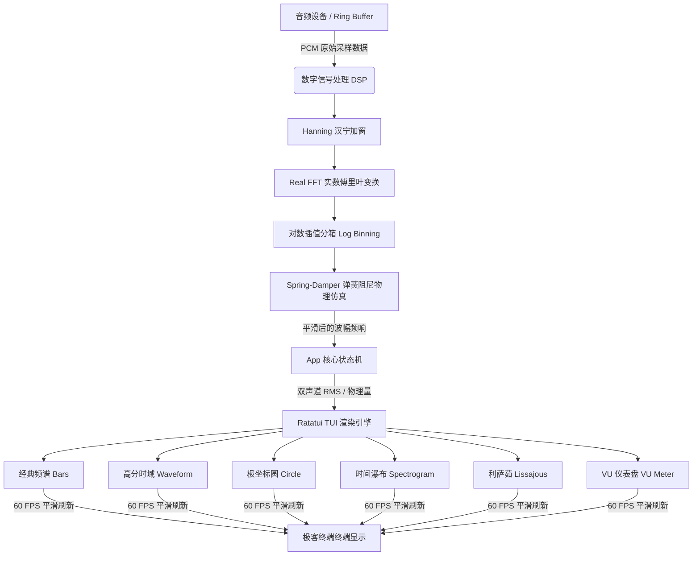

<div align="center">

```text
███╗   ███╗██╗██████╗  █████╗  ██████╗ ███████╗
████╗ ████║██║██╔══██╗██╔══██╗██╔════╝ ██╔════╝
██╔████╔██║██║██████╔╝███████║██║  ███╗█████╗  
██║╚██╔╝██║██║██╔══██╗██╔══██║██║   ██║██╔══╝  
██║ ╚═╝ ██║██║██║  ██║██║  ██║╚██████╔╝███████╗
╚═╝     ╚═╝╚═╝╚═╝  ╚═╝╚═╝  ╚═╝ ╚═════╝ ╚══════╝
```

### Next-Generation TUI Audio Visualizer

*优雅、灵敏、现代，专为极客打造的跨平台终端音波脉冲可视化器。*

[](https://www.rust-lang.org)
[](https://github.com/ratatui-org/ratatui)
[](LICENSE)
[](https://github.com)
[](https://github.com)

</div>

---

## 🌟 核心特性 (Features)

* **⚡ 60 FPS 物理级平滑动效**：舍弃了传统可视化器的生硬截断，Mirage 引入了二阶**弹簧-阻尼物理仿真系统 (Spring-Damper Dynamics)**。频带每一次起伏都带有自然的惯性和回弹，配合 Attack/Release 滤波与高精度高帧率定时器，呈现丝滑且绝对无闪烁的终端波形。
* **🎹 6 种可视化艺术模式**：
  1. `Bars` (经典分频频谱) — 8级精密 Unicode 子方块梯度渲染，伴有缓落 Peak 指针。
  2. `Waveform` (时域示波器) — 2x4 高分辨率盲文 (Braille) 点阵绘制，高频捕捉微小波幅。
  3. `Circle` (极坐标圆形频谱) — 极坐标向外扩散粒子束，内置字符长宽比修正以维持正圆。
  4. `Spectrogram` (滚动瀑布图) — 频率水平展开，色彩亮度深度渐变，记录时间维度的频率流转。
  5. `Lissajous` (相位利萨茹曲线) — L/R 独立声道映射在 2D 平面的声场轨迹，专业音响工程示相。
  6. `VU Meter` (音量计量卡) — 圆角拟真仪表盘，展示 L/R 独立的 RMS 与 Peak Hold 分贝值。
* **🎨 顶级配色终端美学**：拒绝刺眼的纯红纯蓝，精选内置 6 款社区最受欢迎的主题：`Tokyo Night`, `Catppuccin`, `Gruvbox`, `Nord`, `Dracula`, `Everforest`。
* **🛠️ 交互式配置与热加载**：
  * 在 TUI 界面中按下键盘即可调出居中菜单，动态切换音频设备与主题。
  * 外部编辑全局 `config.toml` 时，应用会立即热重载，音频捕获流无缝重连，无闪烁完成热更新。
* **🌐 智能跨平台环回捕获**：
  * **Windows**: 自动挂载 WASAPI loopback 扬声器流。
  * **Linux**: 自适应轮询 PulseAudio/PipeWire 包含 `monitor` 后缀的输入虚拟设备，无需手动重采样或虚拟线。

---

## 🔄 系统数据流 (System Data Flow)

Mirage 内部采用了低延迟采集与物理仿真混合管线，保证了频谱反应的高回弹和顺滑度：



---

## 🛠️ Linux 系统编译依赖

在 Linux 系统上编译 Mirage 需要连接系统的 ALSA 开发包，请在编译前通过您的包管理器安装：

* **Debian / Ubuntu / Linux Mint 等**:
  ```bash
  sudo apt update && sudo apt install -y libasound2-dev build-essential
  ```
* **Fedora / RedHat / RHEL 等**:
  ```bash
  sudo dnf install -y alsa-lib-devel gcc
  ```
* **Arch Linux / Manjaro 等**:
  ```bash
  sudo pacman -S --noconfirm alsa-lib base-devel
  ```

---

## 🚀 安装指南 (Installation)

Mirage 支持在系统的任何工作目录下启动，并共享全局配置文件：
* **Linux / macOS**: `~/.config/mirage/config.toml`
* **Windows**: `%APPDATA%\mirage\config.toml`

### ⚡ 方式 A: 一键脚本自动安装 (推荐)

我们在项目根目录下内置了全自动配置脚本，会自动为您检测系统环境、配置 Rust 工具链（自动测速并启用高速镜像源 `rsproxy-sparse` 或 `tuna-sparse`）、安装 ALSA 依赖、编译并添加环境变量：

* **Linux / macOS 平台**:
  在项目根目录下打开终端并运行：
  ```bash
  chmod +x install.sh && ./install.sh
  ```
* **Windows 平台**:
  在管理员模式的 PowerShell 中切换到项目目录并运行：
  ```powershell
  powershell -ExecutionPolicy Bypass -File .\install.ps1
  ```

> [!IMPORTANT]
> 运行一键脚本完成后，请务必执行 `source ~/.bashrc`（或对应 Shell 的配置文件，如 `~/.zshrc`），或者重新打开终端使环境变量生效。

---

### 📦 方式 B: 手动逐步安装

#### 1. 从源码编译安装
在下载的项目根目录下运行：
```bash
cargo install --path .
```
这会把构建完成的二进制文件 `mirage` 拷贝至您的 Cargo 二进制安装目录（`~/.cargo/bin`）。

#### 2. 检查环境变量 `PATH`
请确保 Cargo 二进制目录已追加到系统 `PATH` 环境变量中。

* **Linux / macOS**:
  在您的 `~/.bashrc` 或 `~/.zshrc` 末尾添加以下内容，并运行 `source <rcfile>`：
  ```bash
  export PATH="$HOME/.cargo/bin:$PATH"
  ```
* **Windows**:
  安装 Rust 时通常已为您自动配置好环境变量。

配置完成后，您可以在系统的任意路径下通过终端运行以下命令即刻启动：
```bash
mirage
```

---

## 🕹️ 键盘快捷交互指南

| 按键 | 功能描述 |
| :--- | :--- |
| `Tab` | 循环切换可视化模式 (Bars ➟ Wave ➟ Circle ➟ Water ➟ Liss ➟ VU) |
| `T` | 呼出**主题选择菜单** (使用 `↑` `↓` 切换，`Enter` 确认，`Esc` 退出) |
| `D` | 呼出**音频设备选择菜单** (使用 `↑` `↓` 切换，`Enter` 确认，`Esc` 退出) |
| `S` | 快速切换信号输入源 (Loopback 环回捕获 ⬌ Mic 麦克风录音) |
| `P` | 开启 / 关闭右侧 System & Audio 状态监控面板 |
| `F1` | 打开 Mirage 详细帮助窗口 |
| `Esc` | 关闭当前所有的悬浮弹窗 |
| `Q` | 安全退出程序并恢复终端 |

---

## ⚙️ 配置文件 `config.toml` 调优指南

首发运行时系统会自动在全局配置目录下生成默认配置。以下是各参数的调优含义，供音响发烧友与极客定制：

```toml
[visualizer]
# 当前启动默认模式 ("bars", "waveform", "circle", "spectrogram", "lissajous", "vu_meter")
mode = "bars"
# 目标刷新帧率，支持设置为 60 或更高
fps = 60
# 频谱柱（Bar）的个数。设置为 0 时为宽度自适应模式，柱数随终端拉伸而自动缩放
bar_count = 0
# 音频增益敏感度乘数，当系统音量较小时可调大（如 1.5, 2.0）
sensitivity = 1.0
# 默认是否渲染侧边监控面板
show_side_panel = true

[audio]
# 目标音频设备名称，设为 "default" 即可享受开箱即用自动环回
device = "default"
# 可选 "loopback" (捕获电脑正在播放的音乐) 或 "mic" (麦克风)
source = "loopback"

[theme]
# 内置主题："tokyo_night", "catppuccin", "gruvbox", "nord", "dracula", "everforest"
name = "tokyo_night"

[physics]
# 普通滤波下降阻尼因子（0.0 到 1.0，值越小下降越缓慢，用于非 Spring 动画过渡）
smoothing = 0.7
# 弹簧仿真系数 K（刚度系数。数值越高，柱子回弹跳跃越迅速）
spring_k = 15.0
# 弹簧阻尼系数 C（摩擦力系数。数值越高，柱子晃动幅度越小，显得厚重沉稳）
spring_damping = 1.8
# 频谱 Peak 顶部横线的下落重力加速度（数值越小，顶部 Peak 停留和滑落越柔和）
gravity = 1.5
```

---

## 📂 项目模块结构树

```text
Mirage/
├── Cargo.toml         # Rust 依赖项与打包配置
├── README.md          # 本指南
├── config.toml        # 默认配置备份
└── src/
    ├── main.rs        # 终端后端设置、60 FPS 渲染主循环及 Panic 兜底恢复
    ├── app.rs         # 核心应用状态机、跨平台配置监控、BPM 估计及系统资源统计
    ├── audio.rs       # 音频流管理、设备轮询及 Windows/Linux 平台捕获兼容适配
    ├── dsp.rs         # 数字信号处理：Hanning 窗、实数 FFT、对数插值及二阶物理弹簧动力学仿真
    ├── theme.rs       # 主题色彩色值定义
    └── ui/
        ├── mod.rs     # UI 组装、快捷键指示绘制、弹出窗口层级调度
        ├── layout.rs  # 屏幕区域划分逻辑
        ├── side_panel.rs # CPU/内存及音频延迟仪表盘绘制
        └── widgets/   # 6 种渲染模式的专属 Widget 绘制组件
```

---

## 💡 常见问题与排错 (FAQ)

#### Q1: 运行命令 `mirage` 提示找不到命令？
> [!WARNING]
> 请确保您已运行 `source ~/.bashrc`（或对应的 Shell 配置文件），以使 `~/.cargo/bin` 路径被加入到环境变量中。您可以通过 `echo $PATH` 检查其是否包含该路径。

#### Q2: 启动后界面为一条直线，无法捕获到任何音频信号？
- **对于 Linux 用户**：
  Mirage 支持自动轮询带有 `monitor` 后缀的环回输入设备。如果您使用的是 PipeWire 或 PulseAudio，请确保通过按下 `D` 呼出音频设备选择菜单，然后切换到正确的 Monitor 监听设备（例如带有 `*.monitor` 结尾的设备）。
- **对于所有用户**：
  若想直接捕获麦克风输入，请在运行中按下 `S` 键切换信号源为 `Mic`。

#### Q3: 终端显示乱码或线条不平滑？
- Mirage 部分可视化模式（如 `Waveform`）依赖高分辨率 Unicode 盲文 (Braille) 字符和精密子方块。请使用支持现代 UTF-8 编码的现代终端仿真器（如 Alacritty, Kitty, WezTerm, Konsole 或 Windows Terminal），并搭配安装 Nerd Font 字体以获得最佳渲染视觉效果。

---

## 📄 许可证 (License)

本项目遵循 **MIT License** 许可协议。
